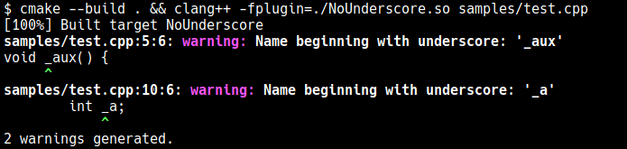

## Description
This is a Clang-11 plugin which adds a diagnostic warning when variable or function names start with underscore `_`.

This is intended as an example to demonstrate building diagnostic plugins to clang.

## Requirements and building

Requires clang-11 with development files (headers) installed on your linux distribution. (Usually something like libclang-11-dev)

sometimes you may get an error when other versions of clang libraries are installed. An easy way around this is to remove packages from other versions of llvm / clang.

You should be able to specify exact path to LLVM headers but I haven't tried that.

```
git clone https://github.com/mahesh-hegde/clang_diag_plugin.git
cd clang_diag_plugin/NoUnderscore
mkdir -p build && cd build/
cmake .. && cmake --build .
```

## Running:

```
# This command is like running GCC
# It must be run after any changes in source file
cmake --build .

# Our plugin is a shared library which exports symbols
# to main Clang executable.
clang++ -fplugin=build/NoUnderscore.so [source_files]

export LD_LIBRARY_PATH=$PWD/build
# To be able to invoke clang from any directory without providing
# relative path to the plugin,
# add the build folder containing [PluginName].so to LD_LIBRARY_PATH.
# to persist this across sessions, add the above to ~/.bashrc or ~/.profile.
```

If you change the name of the project:

* Edit CMakeLists.txt to reflect the changes in filenames.

* remove all cmake related temporary files _except CMakeLists.txt_

* run `cmake .` before next `cmake --build .`

## sample output:



## Appendix

### LSP support
LSP (such as clang based C++ plugins for Vim / VS Code) are quite helpful when experimenting with clang plugins, because documentation is sparse.

If you have an LSP implementation installed and want it to work properly on C++ file, you have to install `bear`. Prefix it the first time you run a cmake build, like this:

```
bear -- cmake --build .
```
if the above doesn't work

```
bear cmake --build .
```

Depending on distro package's version, one or the other should work.

## Frequently asked questions
#### How do I (do XYZ)?
The answer is look at the API documentation (https://clang.llvm.org/doxygen), find the class of the AST node related to the problem you are trying to solve, and write a Visit<ElementType> function. Without something like code completion, this is going to be hard. Follow the LSP setup instructions above for VS Code, or Vim LSPs (coc.nvim or vim-lsc).

#### I am on WSL and can't setup VSCode for some reason.
Try nvim with coc-nvim plugin, and enable easy mode if you are new to vim.

#### How to provide options to plugins?
the `-fplugin-arg` doesn't work in clang, but you can use the old style arguments can still be used to give plugin options.

```bash
export plugin_opt="-Xclang -plugin-arg-<PluginName> -Xclang"
clang -fplugin=path_to_plugin.so $plugin_opt -opt_name ....
```

#### How do I look for complex patterns
* Look at ASTMatchers API.
* Or keep some state of visiting elements in the visitor object. See the next FAQ.

#### How do I call something before and after visiting an element and all its children?
I override Traverse<Element> method and call superclass method in it. Not sure if that's the best method.

